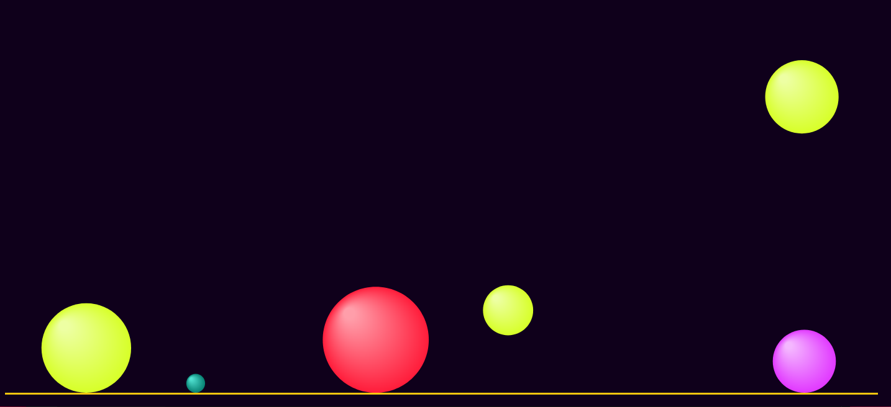
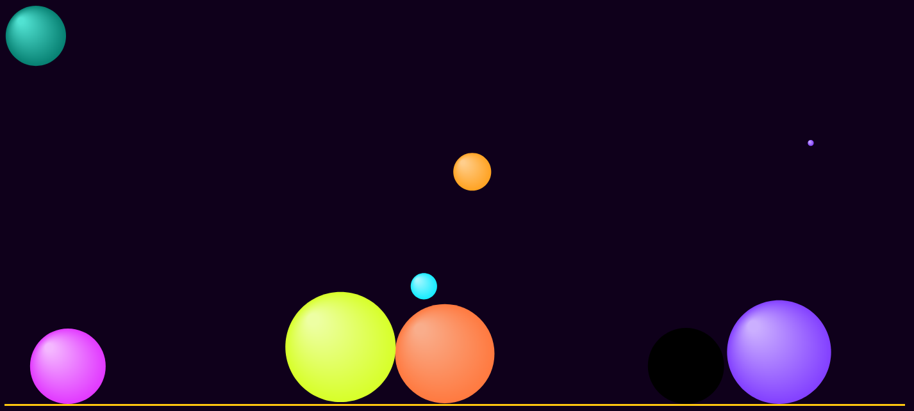

## Bouncing Balls
- A simple JavaScript app; balls of different sizes and colors appear on click, are fired at random directions with random speeds, and bounce off the sides (and off eachother if activated) until stopped by gravity.

- Runs locally with Express.js:
`node server.js` (localhost:8080)

## Author
- Marina D.

## Main references
- https://burakkanber.com/blog/modeling-physics-javascript-gravity-and-drag/;
- https://codepen.io/anon/pen/xorZqx;
- https://developer.mozilla.org/en-US/docs/Games/Techniques/2D_collision_detection;

## Screenshots

